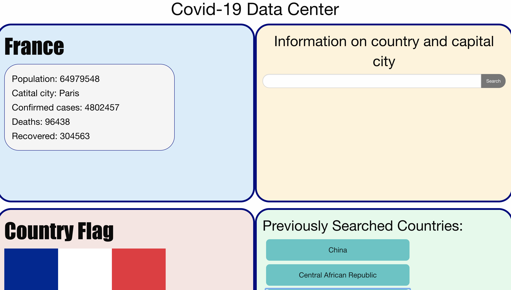

# covid-datacenter

The goal of this project is to create an application that will allow the user to search for a country and be presented with information pertaining to COVID-19 statistics and information about the country, such as the country's population, the capital city, the country's number of COVID deaths, etc... The user will also be presented with the country's flag. This application stores the searches made by the user onto localstorage and displays the search history as a list of buttons. The user can click a previously searched country as opposed to re-searching for the country by using the search box. 

This application will use Foundation for its styling, First API for obtaining COVID information by country, and GeoDB Cities API for obtaining an image of the flags of the countries. There are four team members working on this project. 

link to application:
https://dmitrybalduev.github.io/covid-data-center/

link to github repo:
https://github.com/dmitrybalduev/covid-data-center

